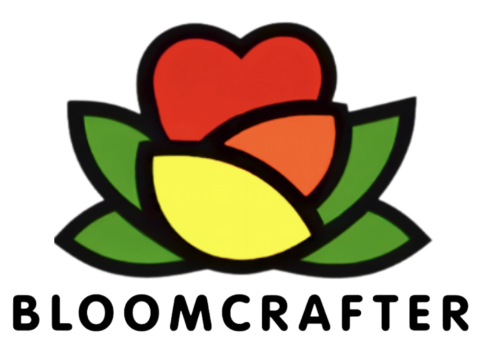
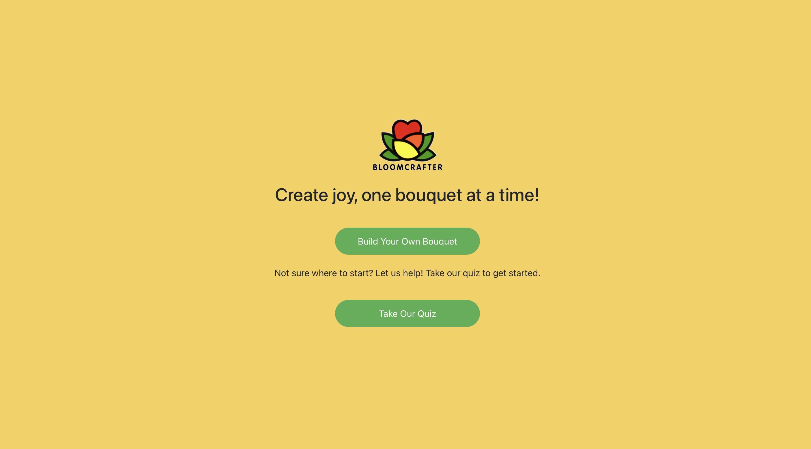
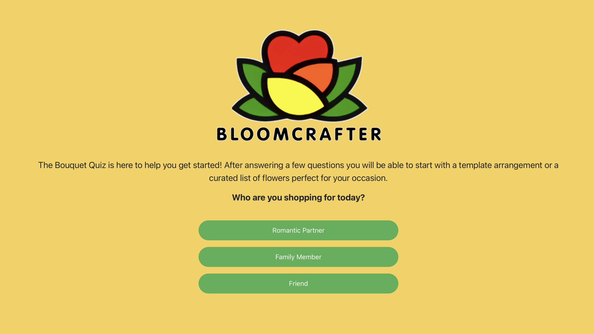
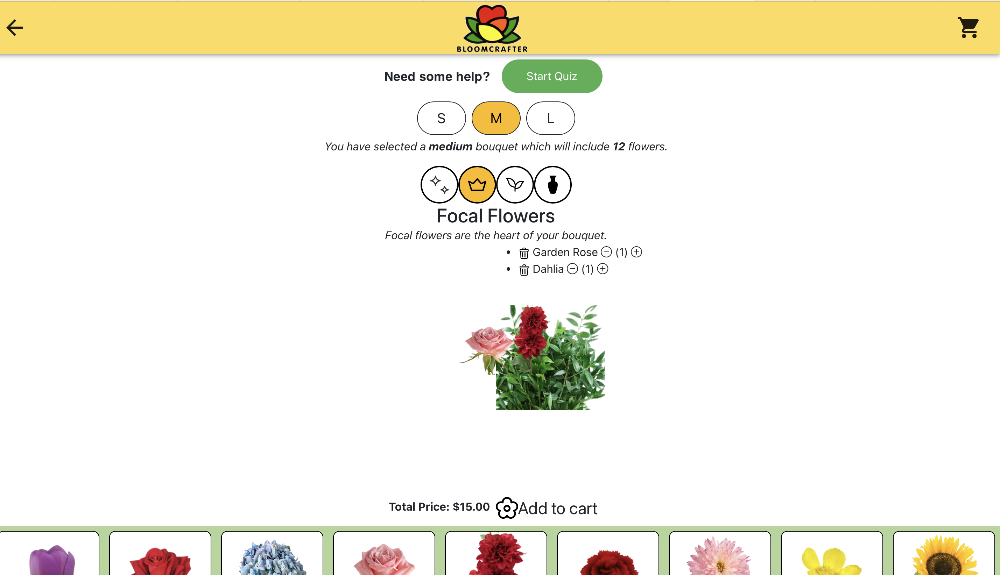

<!-- PROJECT SHIELDS -->
[](https://opensource.org/licenses/MIT)

-->


<!-- PROJECT LOGO -->
<br />
<div align="center">
    <a href="https://github.com/394-w24/BloomCraft2/blob/main/public/icons/logo_2.png">
    
  </a>
  <h3 align="center">BloomCraft2</h3>

  <p align="center">
    An Application empowering users to create personalized floral arrangements and bouquets effortlessly.
    <br />
    <a href="https://github.com/394-w24/BloomCraft2"><strong>Explore the docs »</strong></a>
    <br />
    <br />
    <a href="https://github.com/394-w24/BloomCraft2">View Demo</a>
    ·
    <a href="https://github.com/394-w24/BloomCraft2">Report Bug</a>
    ·
    <a href="https://github.com/394-w24/BloomCraft2">Request Feature</a>
  </p>
</div>


<!-- TABLE OF CONTENTS -->
<details>
  <summary>Table of Contents</summary>
  <ol>
    <li><a href="#about-the-project">About The Project</a></li>
    <li><a href="#getting-started">Getting Started</a></li>
    <li><a href="#usage">Usage</a></li>
  </ol>
</details>


<!-- ABOUT THE PROJECT -->
## About The Project

[](https://github.com/394-w24/BloomCraft2/blob/main/screenshot.png)

BloomCrafter is an application  designed to empower users to create personalized floral arrangements and bouquets effortlessly. The application provides a user-friendly interface for selecting flowers, arranging them, and customizing the final bouquet to suit various occasions and preferences.


### Built With

This section lists the major frameworks/libraries used in the project.

* [React](https://reactjs.org/) - A JavaScript library for building user interfaces.
* [Material-UI](https://mui.com/) - React components for faster and easier web development.
* [Bootstrap](https://getbootstrap.com/) - A front-end framework for building responsive websites.
* [React Router DOM](https://reactrouter.com/en/main) - Routing for React.
* [React Icons](https://react-icons.github.io/react-icons/) - A collection of icons for React applications.


<!-- GETTING STARTED -->
## Getting Started

Welcome to BloomCrafter! This guide will help you set up and run the project on your local machine.

### Prerequisites

Before you begin, make sure you have the following installed:

- npm (Node package manager)
  ```sh
  npm install npm@latest -g
  ```
- Git (to clone the project repository)

### Installation

1. Clone the BloomCraft2 repository to your local machine:
   ```sh
   git clone https://github.com/394-w24/BloomCraft2.git

2. Navigate to the project directory:
   ```sh
   cd BloomCraft2
3. Install the project dependencies:
   ```sh
   npm install

<!-- USAGE -->
### Usage

To use the BloomCraft2 app, follow these steps:

1. **Build Your Bouquet**:
   - Click on the "Build Your Bouquet" button to navigate directly to the bouquet builder page
   - On the bouquet builder page, you can select different flowers and arrange them to create your personalized bouquet.
   -  Click on the desired focal, filler, foliage flowers to add it to your bouquet.

or take our quiz, to get a custom teplate to start with:
[](https://github.com/394-w24/BloomCraft2/blob/main/public/icons/quiz.png)

2. **Customize the size**:
   - Toggle between the small, medium, and large sizes buttons.
[](https://github.com/394-w24/BloomCraft2/blob/main/public/icons/size.png)

3. **View Your Cart**:
   - Click on the shopping cart icon to view your current bouquet selections.
   - You can add or remove flowers from your cart as needed.
    

4. **Generate a Note**:
   - After finalizing your bouquet, you can generate a note to accompany your bouquet.
   - Have fun creating beautiful and personalized bouquets for any occasion!


<!-- KNOWN BUGS -->
### Known Bugs

There are currently no known bugs in the BloomCraft2 app. However, if you encounter any issues, please feel free to report them.

   

